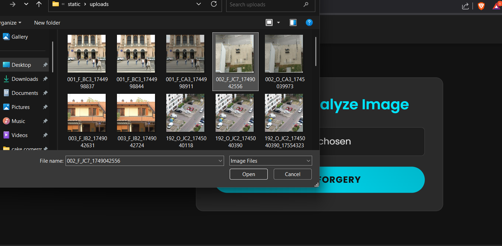
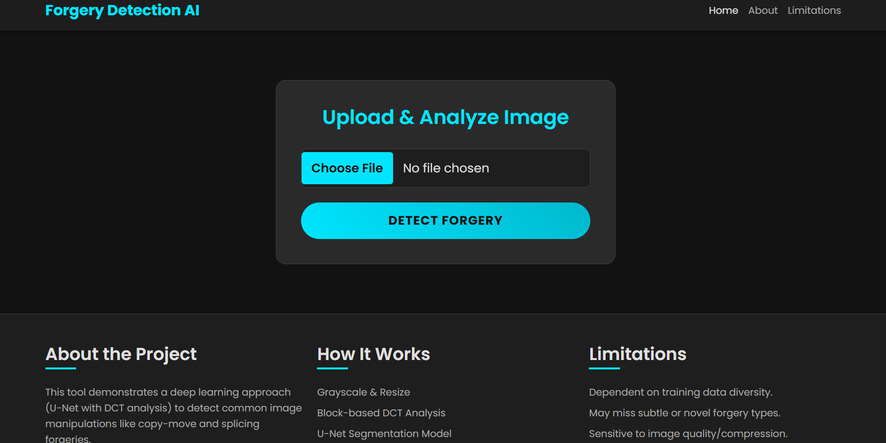

# Image Forgery Detection AI 📸


A web-based application designed to detect digital image forgeries, specifically "copy-move" or splicing manipulations. This project uses a U-Net deep learning model with a pre-processing step involving the Discrete Cosine Transform (DCT) to identify tampered regions within an image.

***

## ## Demo






***

## ## Features ✨

* **Image Upload:** Easily upload images in common formats (JPG, PNG, etc.).
* **Forgery Analysis:** The backend processes the image using a trained U-Net model to predict a forgery mask.
* **Classification:** Classifies the image as either **REAL** or **FORGED** based on the percentage of manipulated pixels detected.
* **Result Visualization:** Displays the original image and the generated mask highlighting the potentially forged areas.
* **Simple UI:** A clean and straightforward user interface built with HTML and Bootstrap.

***

## ## Tech Stack 🛠️

* **Backend:** Python 3.10, Flask
* **Machine Learning:** TensorFlow (Keras API)
* **Image Processing:** OpenCV-Python, NumPy
* **Web Server:** Gunicorn (for deployment)
* **Frontend:** HTML5, CSS3, Bootstrap 5

***

## ## Local Setup & Installation ⚙️

Follow these steps to run the project on your local machine.

**1. Prerequisites:**
* Python 3.10 or higher
* Git and Git LFS (for handling the large model file)

**2. Clone the Repository:**
```bash

git clone (https://github.com/Shubham-711/image-forgery-detector.git)
cd image-forgery-detector
```

**3. Set up the Virtual Environment:**
```bash
# Create a virtual environment
python -m venv venv

# Activate it
# Windows
.\venv\Scripts\activate
# macOS/Linux
source venv/bin/activate
```

**4. Install Dependencies:**
```bash
pip install -r requirements.txt
```

**5. Download the Model File:**
The Keras model is tracked by Git LFS. Run the following command to download it.
```bash
git lfs pull
```

**6. Configure the Secret Key:**
Open `app.py` and replace the placeholder `app.secret_key` with a real, securely generated key. You can generate one in a Python terminal:
```python
import secrets
secrets.token_hex(24)
```

**7. Run the Application:**
```bash
flask run
```
The application will be available at **`http://127.0.0.1:5000`**.

***

## ## Usage 🚀

1.  Navigate to `http://127.0.0.1:5000` in your web browser.
2.  Click **"Choose File"** to select an image from your computer.
3.  Click the **"Detect Forgery"** button to start the analysis.
4.  The page will reload with the prediction results, showing the classification and the generated forgery mask.

***

## ## Project Limitations

* The model's performance is highly dependent on the dataset it was trained on (`CoMoFoD`) and may not generalize perfectly to all types of images or forgeries.
* It is designed primarily for copy-move and splicing forgeries and may not detect other manipulations like inpainting or lighting changes.
* This is a proof-of-concept project and is not intended for forensic-grade professional use.

***

## ## License

Distributed under the MIT License. See `LICENSE` for more information.
*(
